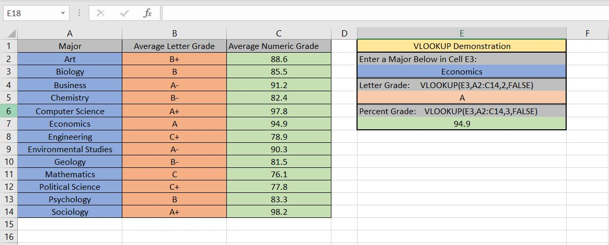
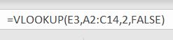
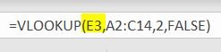
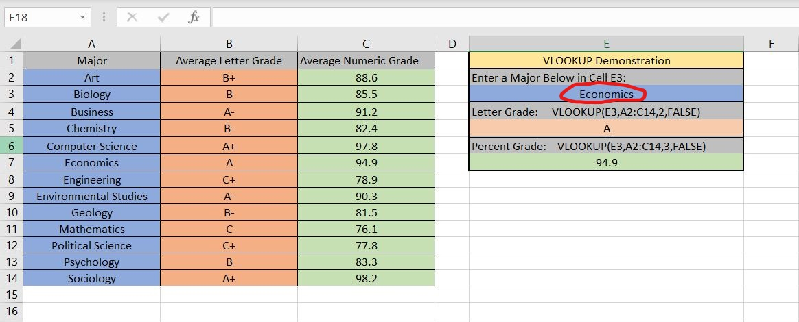
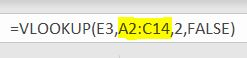
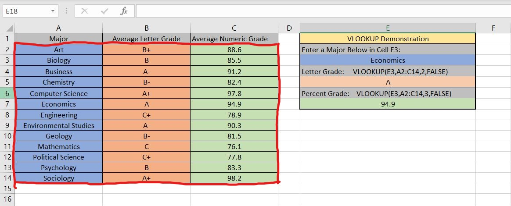
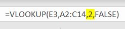
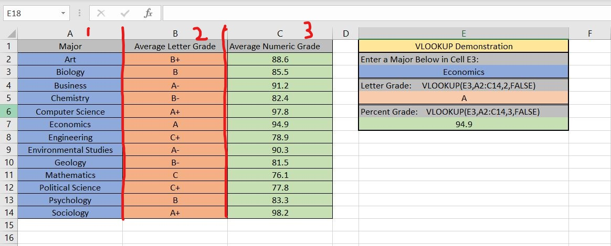
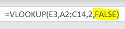
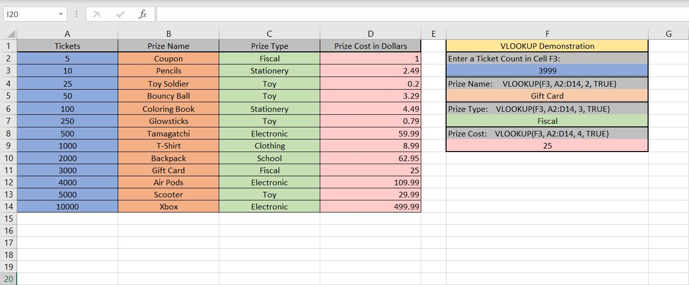

# **Excel Explainer: VLOOKUP**
**By: Eythan Jenkins**

## What is VLOOKUP
Excel's VLOOKUP tool is a search function for "when you need to find things in a table or a range by row." (support.microsoft.com) Essentially, you give VLOOKUP input, Excel searches for that input in the chart, and finally it will give you the value associated with that input. I like to think of it as being similar to a hash table or dictionary: you provide the VLOOKUP function with your 'key', and it returns the 'value' of that key.

## Why to use VLOOKUP
A search function like VLOOKUP makes it easy to find values fast within an Excel sheet. Instead of having to maually navigate the sheet for your data of interest, you can simply search up the term you are looking for, and the value will be returned to you. An example of this can be seen below:

In the above example, the user is prompted to put a 'Major' into the blue cell E3. After doing this, the orange and green fields in cells E5 and E7 will return values extracted from the VLOOKUP function. While this example looked at the functionality on a small scale, VLOOKUP would be extremely useful in scenarios where there are hundreds or thousands of data points to look through. For instance, an excel sheet for a supermarket may contain all of the products, the quantity in store, and the retail price. Instead of having to go through a list of all the products, and manually find one's price, VLOOKUP can be used to expedite the process: all you need is the name of the item. 

## How to Use VLOOKUP
A VLOOKUP function will likely look like this:

To use, the VLOOKUP function is written into a cell. After writing your initial "=VLOOKUP()", there will be four variables of interest to enter into the function:

### What You are Looking For/ Key

This first value refers to what you are searching for / 'the key.' This value can be hardcoded in (I could have put 'Economics' in place of 'E3'). However, this makes it a little less flexible, since you will always have to go back into the function to make a change. Instead, by using a cell, I can just go into that cell and change that value.

### Range to Search

This second zone is the scope of the VLOOKUP function. This is where the VLOOKUP function is going to look for the key and the corresponding values. In this example, the keys and their corresponding values exist from A2:C14, so I enter that into the function for the range.

### Which Column to Return From

The third part of the VLOOKUP function refers to which column of the range should be returned to the function as the found value. So if I want the value from the B column, I enter 2, since that is the second column within the range of my function.

### Approximate or Exact Key Match

The final part of the VLOOKUP function is a boolean value: 'False' determines whether the key needs to perfectly match, and 'True' permits there to be an 'approximate' match. By 'approximate,' VLOOKUP "returns the next largest value that is less than your specific lookup value." (extendoffice.com) Because of how it is defined, it requires the dataset to either be sorted alphabetically or numerically to correctly function. Because the value is False in this case, the search key must match exactly, else it will return a N/A value to the return fields.

A time when it may be helpful to set it to true is if you have a dataset with multiple thresholds. Instead of needing a value for every possible dataset, you can use the approximate value and VLOOKUP will be able to return a value despite it not being an exact match. Another example demonstrates the usefulness of this variable:

## Data Used

## References
#### VLOOKUP Function Basics:
[support.microsoft.com](https://support.microsoft.com/en-us/office/vlookup-function-0bbc8083-26fe-4963-8ab8-93a18ad188a1)
#### VLOOKUP Approximate versus Exact Values:
[extendoffice.com](https://www.extendoffice.com/documents/excel/2443-excel-vlookup-exact-approximate-match.html)

